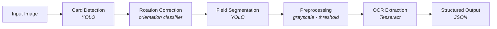

# ID Card OCR System

This project is a comprehensive solution for extracting structured information from identification cards using deep learning-based detection, segmentation, and OCR. Given a scanned or photographed ID card, the system automatically locates the card, isolates each data field, corrects for rotation, and extracts the text — first name, last name, national ID number, birth date, and expiry date — into structured, machine-readable output.


> Built and shipped an end-to-end ID card OCR pipeline — from YOLO-based card detection through rotation correction and bilingual (Farsi/Arabic-script) text extraction — deployed in production for automated identity verification. **Designed the system to be modular and debuggable by stage, and solved a non-obvious rotation-regression failure mode by reframing it as a classification problem, a fix that's easy to overlook but made the difference between a model that converged and one that didn't.**

> This repository documents the system design and approach. Model weights, proprietary training data, and internal deployment configuration are not included, as this work was developed under contract for a commercial identity-verification product.

## Key Features

- **Automatic ID card detection** — a YOLO-based detector locates the card within an arbitrary photo or scan.
- **Rotation correction** — a lightweight classifier estimates and corrects the card's orientation before extraction, so downstream segmentation isn't thrown off by a tilted or upside-down capture.
- **Field segmentation** — the corrected card is segmented into individual fields (name, last name, father's name, national ID, birth date, expiry date) rather than OCR'd as one flat block of text.
- **Bilingual OCR extraction** — Tesseract-based models, separately trained for Farsi digits and Farsi/Arabic-script alphabets, extract text from each segment.
- **API integration** — served over a gRPC API for straightforward integration into onboarding and identity-verification pipelines.

## System Overview



Each stage is a separate, independently-trained model, which keeps failures diagnosable — a bad extraction can usually be traced to a specific stage (missed detection, wrong rotation, poor segment crop, or an OCR miss) rather than debugged as one opaque end-to-end system.

## Modeling Approach

**Card & field detection.** Built on a YOLOv8s backbone pretrained on COCO, with the backbone frozen during fine-tuning — this reduced overfitting and gave better generalization than fine-tuning end-to-end, given the size of the labeled dataset. Training data was expanded significantly through augmentation (brightness/contrast shifts, simulated fog and shadow, color-channel shifts, scale variation, cutout, and safe rotation via [Albumentations](https://albumentations.ai/)), plus a custom rotation-based augmentation, to make the detector robust to real-world capture conditions — phone cameras, scanners, variable lighting.

**Rotation correction.** This one had an interesting design detour worth documenting: rotation was initially framed as a regression problem (predict the angle directly), but angles near the 0°/360° wraparound broke that framing — two visually near-identical images (rotated 1° and 359°) have numerically distant regression targets, which produces a non-convex loss landscape and stalls training. The fix was reframing it as classification over 5°-wide angle bins instead of regression over a continuous angle — trading a small amount of precision for a well-behaved, convergent training objective. The classifier itself is a compact MobileNetV1 variant, chosen specifically for low latency in a real-time pipeline.

**OCR extraction.** Rather than one general-purpose OCR model, digits and alphabet fields are handled by separately fine-tuned Tesseract models — digits use an English-base model (Farsi digits are normalized to their English-numeral equivalents first), while alphabet fields use an Arabic-base model with right-to-left text handling, since Farsi shares its script with Arabic but not its digit glyphs.

## Evaluation

End-to-end performance (detection → rotation → segmentation → OCR, combined) was measured against a held-out set of manually labeled ID card images, each paired with ground-truth field values in JSON format:

```json
{
    "NATIONAL_ID": "0012345678",
    "BIRTH_DATE": "1370/05/12",
    "EXPIRE_DATE": "1405/05/12",
    "NAME": "Example",
    "LAST_NAME": "Example",
    "FATHER_NAME": "Example"
}
```

## Tech Stack

`Python` · `PyTorch` · `Ultralytics YOLOv8` · `Tesseract OCR` · `Albumentations` · `gRPC` · `OpenCV`


## Demo

An interactive walkthrough of the pipeline — detection → rotation correction → segmentation → OCR → structured output — is included at [`demo/demo.html`](./demo/demo.html) (open it directly in a browser, or view it live if GitHub Pages is enabled for this repo).

*The demo uses a synthetic, generic card mock-up with placeholder values — no real document design, personal data, or production model output is shown.*

